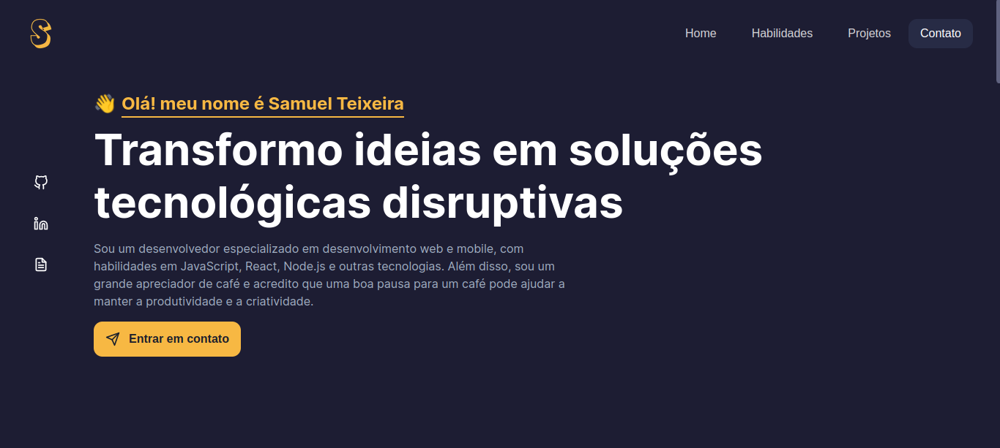

# Samuel's Website Portfolio
###### 🚀 Let's code? contribute to the project

This is my personal web portfolio built with React, showcasing my skills and projects as a developer.
## ⚡️ Demo
###### [🔗 samuelmteixeira.dev](https://samuelmteixeira.dev)



## ▶️ Run Locally

This project uses pnpm as package installer.

Clone the project

```bash
  git clone https://github.com/SamuelMTeixeira/Portfolio.git portfolio-project
```

Go to the project directory

```bash
  cd portfolio-project
```

Install dependencies

```bash
  pnpm install
```

Start the project

```bash
  pnpm dev
```

## ⚙️ Environment Variables

For the e-mail service to work, you need to create an account at emailjs.com and then you need to set up tokens in the ```.env``` file (use the .env.example template as a reference) for the following services:

`NEXT_PUBLIC_EMAIL_PUBLIC_KEY`

`NEXT_PUBLIC_EMAIL_SERVICE_ID`

`NEXT_PUBLIC_EMAIL_TEMPLATE_ID`

`NOTION_TOKEN`

`NOTION_PROJECTS_DATABASE_ID`

For more information how to configure the email service, see the documentation: [🔗 Email.js docs](https://www.emailjs.com/docs/introduction/how-does-emailjs-work/)

## ℹ️ Contributing

Contributions are always welcome!

See `contributing.md` for ways to get started.

Please adhere to this project's `code of conduct`.
## 🤝 Collabs

|  |
| ----------------------------------------------------------------- |
| [Samuel M. Teixeira](https://github.com/SamuelMTeixeira)          |