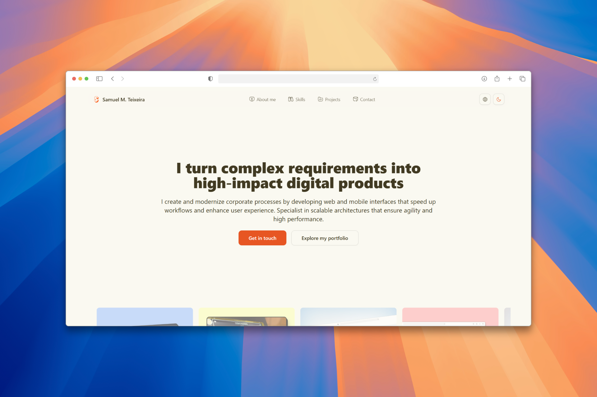

# Samuel's Website Portfolio
###### 🚀 Let's code? contribute to the project

This is my personal web portfolio built with React, showcasing my skills and projects as a developer.
## ⚡️ Demo
###### [🔗 samuelmteixeira.dev](https://samuelmteixeira.dev)



## ⚙️ Setup the project and configure the environment variables

To configure the project, you need to set the following environment variables in your `.env` file. You can use the `.env.example` as a reference.

#### Email Service
1. Create an account at [Resend](https://resend.com).
2. Set the following variable in the `.env` file:

   ```bash
   RESEND_API_KEY=your_resend_api_key
   ```

   For detailed setup instructions, check the [Resend documentation](https://resend.com/docs/introduction).

#### Notion Database
1. Set up the following variables in the `.env` file:

   ```bash
   NOTION_TOKEN=your_notion_token
   NOTION_DATABASE_ID=your_database_id
   ```

   For more information on configuring Notion as a database, refer to this [guide](https://dev.to/iamhectorsosa/using-notion-as-your-database-2k15).

## ▶️ Run Locally

This project uses pnpm as package installer.

Clone the project

```bash
  git clone https://github.com/SamuelMTeixeira/Portfolio.git portfolio-project
```

Go to the project directory

```bash
  cd portfolio-project
```

Install dependencies

```bash
  pnpm install
```

Start the project

```bash
  pnpm dev
```

## ℹ️ Contributing

Contributions are always welcome!

See `contributing.md` for ways to get started.

Please adhere to this project's `code of conduct`.
## 🤝 Collabs

|  |
| ----------------------------------------------------------------- |
| [Samuel M. Teixeira](https://github.com/SamuelMTeixeira)          |